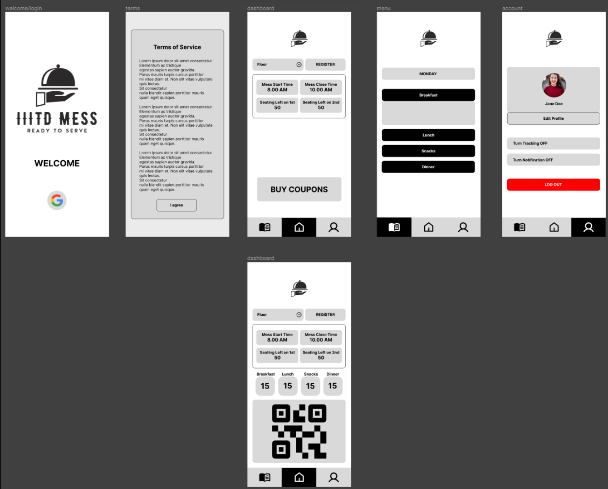
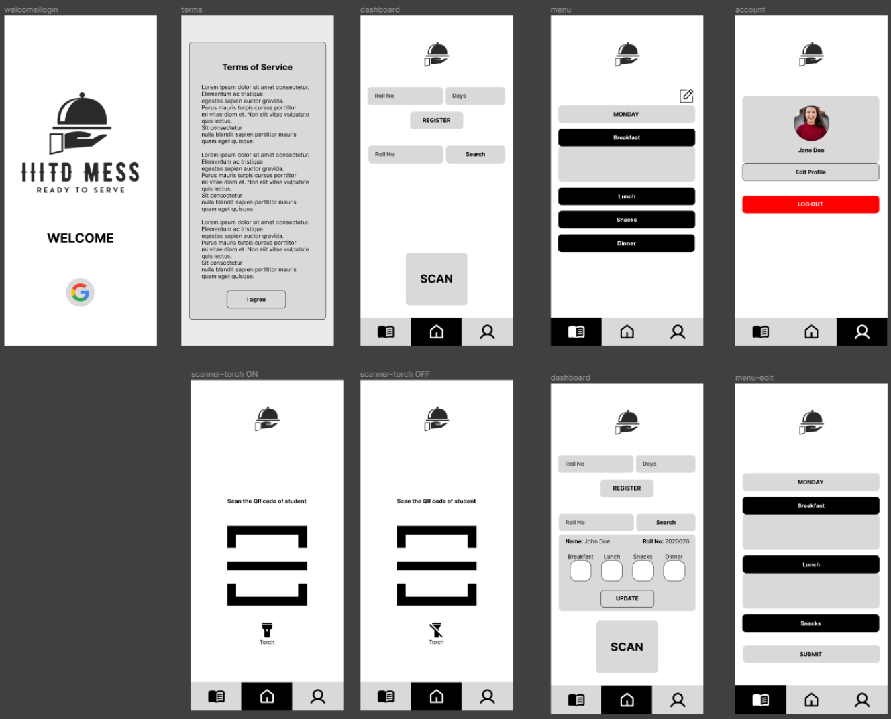

> The **_IIITD_Mess_** android app tracks the mess's occupancy, comprising the first and second floors. The app utilizes **Access Points** to determine the number of **clients** associated with each floor, enabling it to assess the presence of users in the mess. The app also analyzes the **Received Signal Strength Indicator** (RSSI) to verify if users are located inside the mess or associated with the access points but potentially situated outside the mess on the ground floor.   
The app also has two portals:  **Student** and **Admin**.  
The **Student** portal enables IIITD students to conveniently purchase mess coupons for breakfast, lunch, snacks, and dinner every month.
It provides students access to the daily menu and facilitates coupon purchases using QR code scanning.  
The **Admin** portal empowers the administrator to set the menu for each day and efficiently manage student records.
The admin can view and manipulate student data if required. 

### :busts_in_silhouette: Student Portal

### :busts_in_silhouette: Admin Portal

<h2> Tech Stack </h2>

- Design: **Figma**
- Programming Language: **Java**
- Backend: **Node.js**
- Database: **MongoDB**
- Authentication: **IIITD-only Google Authentication**
- Location Services: User tracking using **location services**

### :busts_in_silhouette: Other Contributors
- [Deeksha Singh Duves](https://github.com/deeksha20049)
- [Pragyan Yadav](https://github.com/sc0rp10n-py)
- [Raman Diwakar](https://github.com/ramandiwakar)
- [Rohan Danday](https://github.com/rohan19094)
